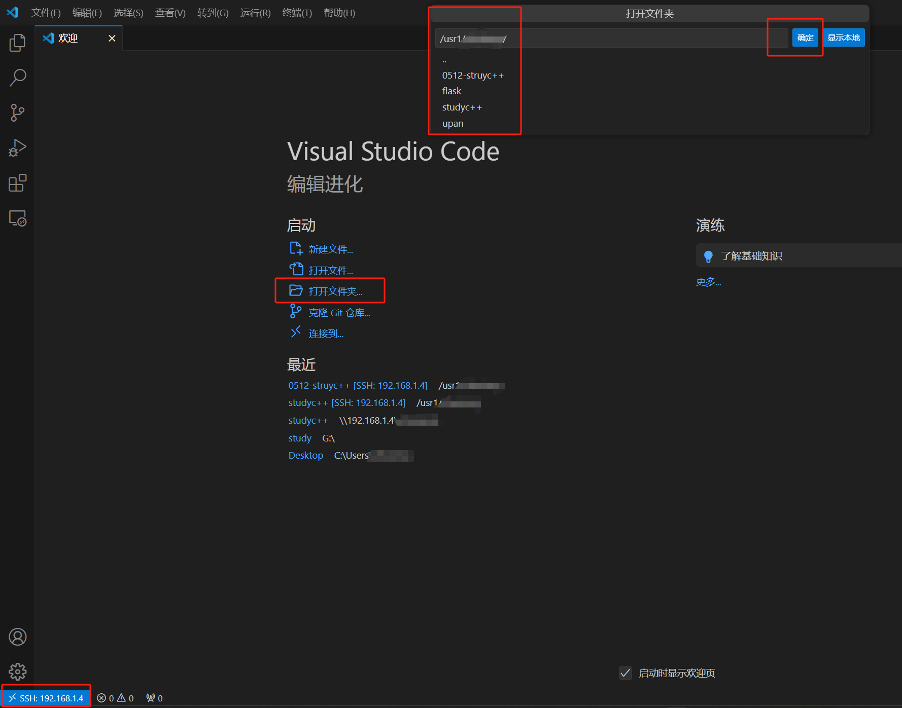

# C-Study
C++入坑的内容都在里面,
 基本是学习C++的心得
## OpenEuler 版本树莓派VScode配置
VScode刚开始连接SSH远程服务器的时候会出现无法安装vscode-server的情况
参考这个博客
https://zhuanlan.zhihu.com/p/671718415?utm_id=0
```shell
dnf install wget
cd ~
wget -c https://update.code.visualstudio.com/commit:af28b32d7e553898b2a91af498b1fb666fdebe0c/server-linux-x64/stable
mv stable ~/vscode-server.tar.gz
tar -zxvf vscode-server.tar.gz
mv vscode-server-linux-x64/ vscode-server
```
然后再连接就可以了，这个就可以直接访问远端的地址，类似于wecode的方式,而且可以执行远端的命令,避免了samba的缺点


## 安装gcc和g++
```shell
dnf install g++
dnf install gcc-c++
```
