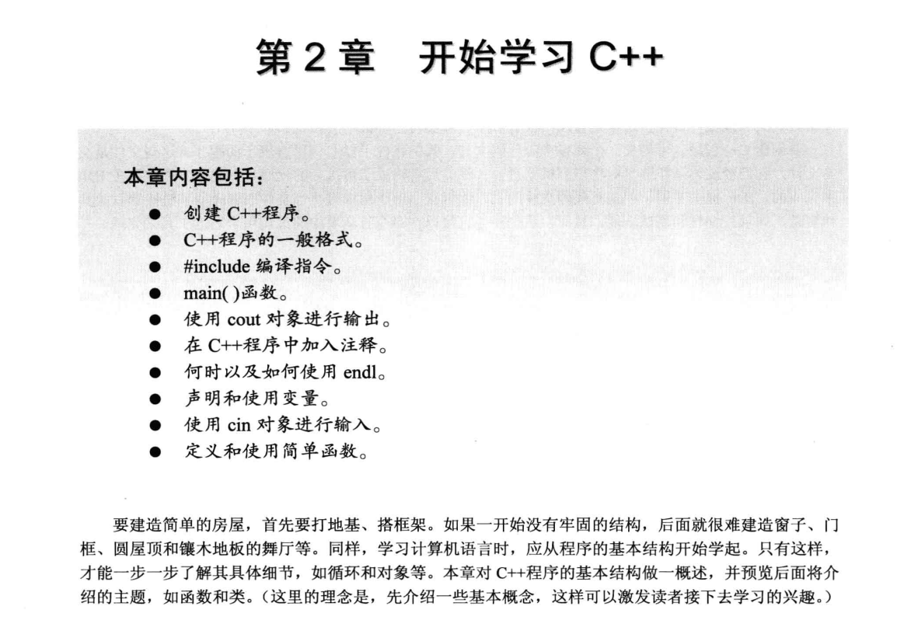

#### 本章主要是带你进入C++的世界
主要就是吉纳丹的C++程序编写和using指令，命名空间的一些内容  

2.1 进入C++  
2.1.1 main()函数  
2.1.2 C++注释  
2.1.3 C++预处理器和iostream文件  
2.1.4 头文件名  
2.1.5 名称空间  
2.1.6 使用cout进行C++输出  
2.1.7 C++源代码的格式化  
2.2 C++语句  
2.2.1 声明语句和变量  
2.2.2 赋值语句  
2.2.3 cout的新花样  
2.3 其他C++语句  
2.3.1 使用cin  
2.3.2 使用cout进行拼接  
2.3.3 类简介  
2.4 函数  
2.4.1 使用有返回值的函数  
2.4.2 函数变体  
2.4.3 用户定义的函数  
2.4.4 用户定义的有返回值的函数  
2.4.5 在多函数程序中使用using编译指令  
2.5 总结  
2.6 复习题  
2.7 编程练习  