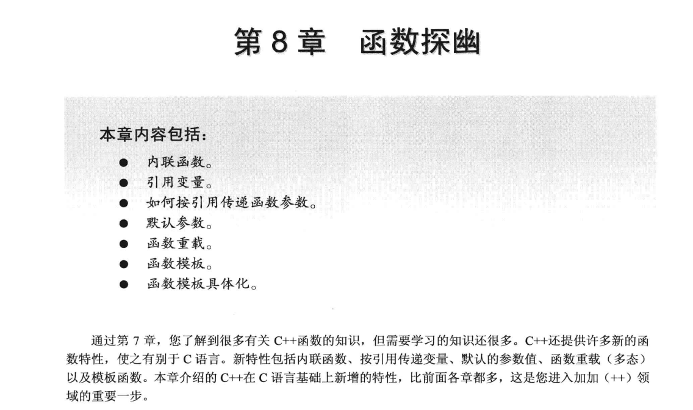

#### 本章主要是带你进入C++的世界 

```
第8章 函数探幽
8.1 C++内联函数
8.2 引用变量
    8.2.1 创建引用变量
    8.2.2 将引用用作函数参数
    8.2.3 引用的属性和特别之处
    8.2.4 将引用用于结构
    8.2.5 将引用用于类对象
    8.2.6 对象、继承和引用
    8.2.7 何时使用引用参数
8.3 默认参数
8.4 函数重载
    8.4.1 重载示例
    8.4.2 何时使用函数重载
8.5 函数模板
    8.5.1 重载的模板
    8.5.2 模板的局限性
    8.5.3 显式具体化
    8.5.4 实例化和具体化
    8.5.5 编译器选择使用哪个函数版本
    8.5.6 模板函数的发展
8.6 总结
8.7 复习题
8.8 编程练习
```